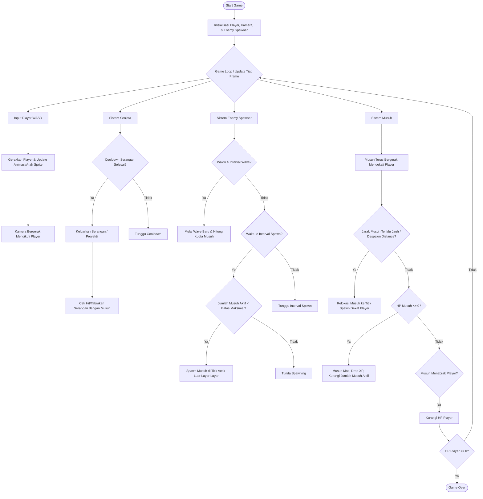

# Project Multimedia - An Ordinary Zombie Game
Futsuu ni Zonbi Ge atau An Ordnary Zombie Game adalah sebuah game roguelike, di mana karakternya seorang penduduk desan bernama Yamato berusaha bertahan hidup selama mungkin dari Zombie Apocalypse.

Project ini merupakan pemenuhan tugas projek praktikum Multimedia, yaitu membuat 2D game dengan Unity.

## Developer
- Syakir Alamsyah
- Kristoforus Noventa
- Todo Christanto P.S.
- FX.Oktabimo DwiPriabudi Sumintro
- Rafa Fakhri Aldivi

## 📊 Mermaid Diagrams

